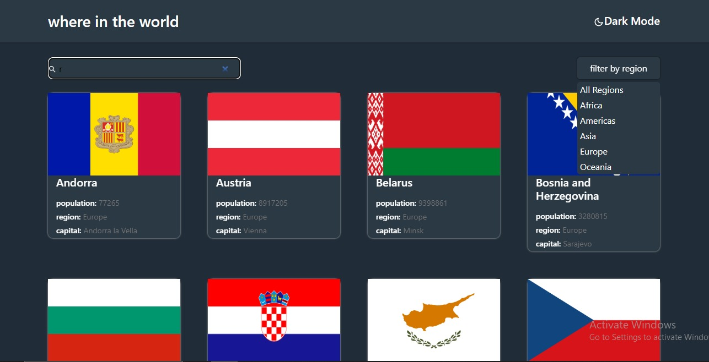

## Overview

### The challenge

Users should be able to:

- See all countries from the API on the homepage
- Search for a country using an `input` field
- Filter countries by region
- Click on a country to see more detailed information on a separate page
- Click through to the border countries on the detail page
- Toggle the color scheme between light and dark mode *(optional)*

### Screenshot

### Links

- Solution URL: [Add solution URL here](https://github.com/seifelden66/frontendmonetor-countries)
- Live Site URL: [Add live site URL here](https://main--silver-alfajores-508c73.netlify.app/)

## My process

### Built with

- media queries
- Flexbox
- CSS Grid
- Mobile-first workflow
- [pug](https://pugjs.org/api/getting-started.html) - JS library
- [vue](https://vuejs.org/) - JS framework
- [Next.js](https://nuxtjs.org/) - vue framework
- [Styled Components](https://getbootstrap.com/) - For styles

**Note: These are just examples. Delete this note and replace the list above with your own choices**

## Author

- Website - [seif elden mohamed elesawy](seif-elden.netlify.app)
- Frontend Mentor - [@seifelden66](https://www.frontendmentor.io/profile/seifelden66)
- Twitter - [@seifelden66](https://twitter.com/Seifelden66)
